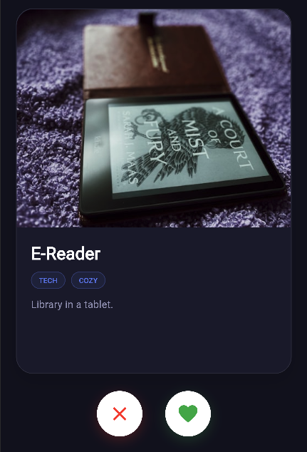

# Gift Giving Tinder


A Flutter app that helps you and a partner to discover gift ideas by swiping on interests. The app learns from your likes, narrows down categories, and shows shared “gift idea” combinations you can search on stores like Amazon, Target, and Walmart.

## What it does

- **Swipe** – Browse style, color, brand, hobby, and other interest cards. Swipe right to like, left to pass. Likes are saved and used to personalize suggestions.



- **Partner** – Link with someone via a one-time code (friend-request style: send code, they enter it, accept/decline). See their top categories and AI-generated gift combinations, and open searches on Amazon, Target, or Walmart.
- **Settings** – Account (name, email, password), theme (dark / light), and a deletable list of your liked categories and tags from Firestore.

## Tech stack

- **Flutter** (Dart) – Web, Android, iOS.
- **Firebase** – Auth (email/password), Firestore (users, preferences, swipes, partner requests).
- **ML-style logic** – In-app adaptive recommender and gift recommender that narrow categories and suggest combinations from your and your partner’s likes.

## Project layout

```
Gift Giving Tinder/
├── README.md                 ← you are here
└── flutter_app/              ← Flutter app
    ├── lib/
    │   ├── main.dart
    │   ├── theme.dart
    │   ├── firebase_options.dart
    │   ├── login_page.dart, onboarding_page.dart, forgot_password_page.dart
    │   ├── pages/             (home, swipe, partner, settings)
    │   ├── models/            (user, swipe_item)
    │   ├── services/           (auth, theme, seed data, Unsplash, ML recommenders)
    │   └── utils/             (open URL for web)
    ├── .env.example           ← copy to .env and fill in
    ├── ENV_SETUP.md           ← env vars and Firebase
    ├── DEPLOYMENT.md          ← Android & iOS store deployment
    ├── firestore.rules
    └── README.md
```

## Quick start

1. **Clone and open** the repo; use the `flutter_app` folder as the app root.

2. **Environment**
   - `cd flutter_app`
   - `cp .env.example .env`
   - Add your Firebase (and optionally Unsplash) values – see [flutter_app/ENV_SETUP.md](flutter_app/ENV_SETUP.md).

3. **Run**
   - `flutter pub get`
   - `flutter run -d chrome` (or another device).

4. **Firestore** – Deploy [flutter_app/firestore.rules](flutter_app/firestore.rules) so auth and partner features work (Firebase Console or `firebase deploy --only firestore:rules`).

## Deploying to stores

- **Android / iOS** – Add Firebase Android and iOS apps, drop in `google-services.json` and `GoogleService-Info.plist`, then follow [flutter_app/DEPLOYMENT.md](flutter_app/DEPLOYMENT.md) for signing and store submission.

## License / use

Use this as a portfolio or learning project. Firebase and third-party services (e.g. Unsplash) have their own terms and quotas.
